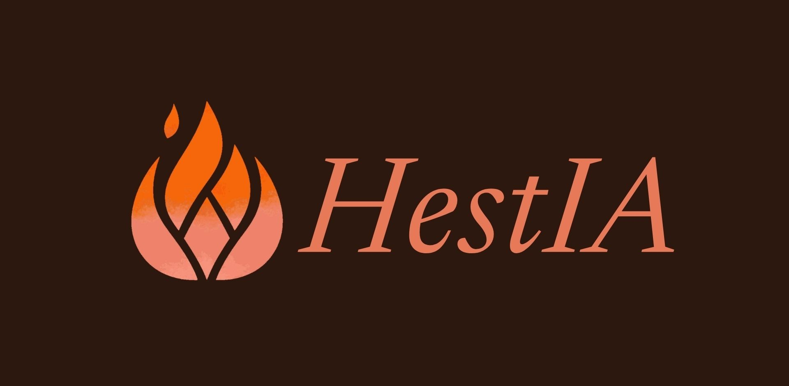

<picture>
  <source
    media="(prefers-color-scheme: light)" srcset="./public/imgs/HestIAbannerclaro.jpg" width="100%"
  >
  
</picture>

<!-- <div align="center">
    
</div> -->

# HestIA (Frontend) - Asistente culinario inteligente

<p align="justify">Interfaz desarrollada en React que permite al usuario ingresar los ingredientes disponibles en su despensa y recibir sugerencias de recetas personalizadas.</p>

<p>&#128279; El repositorio del backend se encuentra en <a href="https://github.com/DanyGeier/hestia-back/tree/main" title="Backend HestIA" target="_blank">HestIA-Backend</a></p>

## Tecnologías
<div>


<ul>
    <li>Versión: 19.2.6</li>
    <li>Uso: Biblioteca principal de UI</li>
</ul>
</div>

<br>

<div>


<ul>
    <li>Versión: 8.0.12</li>
    <li>Uso: Entorno de desarrollo y bundler</li>
</ul>
</div>

<br>

<div>


<ul>
    <li>Versión: 10.3.0</li>
    <li>Uso: Linting y calidad de código</li>
</ul>
</div>

## Requisitos previos
<p align="justify">Antes de instalar el proyecto asegurate de tener instalado:</p>


( Versión 18 o superior)


(Viene incluido con Node.js)

## Instalación

1. Clonar el repositorio

```bash
    git clone https://github.com/Betastica/hestia-frontend.git
```

2. Entrar a la carpeta del proyecto

```bash
    cd hestia-frontend
```

3. Instalar las dependencias

```bash
    npm install
```

4. Iniciar el servidor de desarrollo

```bash
    npm run dev
```

5. Abrir el navegador en `http://localhost:5173`

## Estructura del proyecto

<p>&#128679; En construcción</p>

## Autores

&#129744; [Ann Giuliani Melissa](https://github.com/Melissa-Ann-Giuliani)

&#127827; [Cejas Diana](https://github.com/dianacejas)

&#127813; [Chicconi Luca](https://github.com/LucaChicconi)

&#127825; [Coca Guadalupe](https://github.com/gcoca-sys)

&#129381; [Geier Daniel](https://github.com/DanyGeier)

&#129389; [Rojas Betania](https://github.com/Betastica)

&#127818; [Simonetti Antonella](https://github.com/AntonellaSimonetti)

## Maquetado

&#128279; <a href="https://www.figma.com/design/7hycHYWoKrz0G1Yd8HOlGA/HestIA-Prototype?node-id=495-3442&t=mSVmfTvgGtpia0jK-0" title="Maquetado Figma" target="_blank">Ver maqueta en Figma</a>
